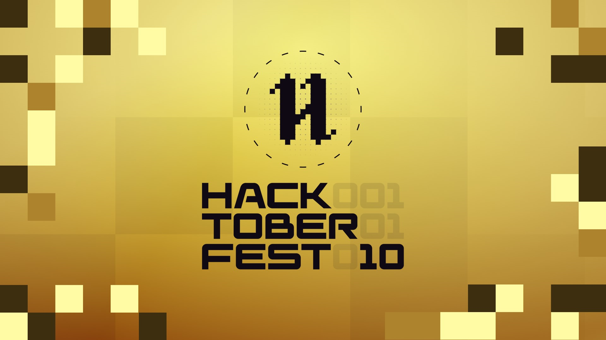

# Checklist

Checklist is a premier online platform meticulously tailored for discerning engineering students and tech enthusiasts. Our cutting-edge website delivers meticulously curated, comprehensive, and easily comprehensible resources elucidating a diverse array of intricate technological concepts. Seamlessly blending clarity with depth, we facilitate efficient last-minute revisions, bolstered interview preparations, and effective exam studies, fostering a holistic learning experience for our esteemed users. With our unwavering commitment to excellence, Checklist emerges as the quintessential destination for individuals striving for technical prowess and academic success.

### Prerequisites

Before you begin, ensure you have met the following requirements:

* [Git](https://git-scm.com/downloads "Download Git") must be installed on your operating system.

### Run Locally

To run **checklist** locally, run this command on your git bash:

Linux and macOS:

```bash
sudo git clone https://github.com/UjjwalSharma01/checklist.git
```

Windows:

```bash
git clone https://github.com/UjjwalSharma01/checklist.git
```

## Features

- **Learning Paths:** Choose from a variety of learning paths, including "Basics of Programming in C++," "STL," "Object-Oriented Programming (OOP)," "Data Structures and Algorithms (DSA)," and more. We cover a wide range of tech topics to suit your learning needs.

- **Interactive Checklist:** Track your progress with an interactive checklist. Mark topics as completed and keep your learning organized.

- **Concept Details:** Dive deeper into a topic by clicking on it. Access concise and informative notes that will help you grasp the core concepts.

## Usage

Checklist can be used for:

- Understanding specific tech topics.
- Last-minute revisions before exams or interviews.

## Demo

Explore Checklist in action: [Checklist Demo](https://checklist-theta.vercel.app/)

## Contributing

We welcome contributions to Checklist. Please refer to our [Contributing Guidelines](Contributing.md) for more information on how to get involved.

## License

Checklist is open-source and available under the [MIT License](LICENSE).

## Contributors

<a href="https://github.com/UjjwalSharma01/checklist/graphs/contributors">
  
</a>

---

We hope Checklist helps you in your tech learning journey! If you have any questions or suggestions, feel free to reach out to us.
